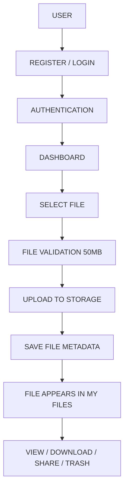

# 📁 ShareVault - Cloud File Sharing SaaS

> **Tagline:** "Upload. Share. Access. Anywhere."

ShareVault is a high-performance, full-stack cloud file-sharing web application built with React, Vite, Node.js/Express, and Supabase (Auth, PostgreSQL DB, and Storage). Designed with a modern glassmorphism aesthetic matching a high-contrast palette of Midnight Navy (`#071A2B`), Electric Blue (`#2563EB`), Cyber Cyan (`#22D3EE`), and Vibrant Orange (`#FF7A18`).

---

## 🚀 Key Features

- **🔐 Secure Authentication**: User Registration, Login, Session Management, Password Visibility Toggle, Form Validation.
- **📤 Real Drag & Drop File Upload**: Supports PDF, DOCX, XLSX, PPTX, JPG, PNG, GIF, ZIP, TXT, CSV up to 50MB with instant type & size validation and progress bar.
- **📋 Real File Storage & Metadata**: Stores real binary payloads on server storage / Supabase Storage with linked PostgreSQL database entries.
- **📥 Real File Download**: Generates attachment streams / secure URLs to download actual uploaded file binaries.
- **🔍 Global Search & Filtering**: Instant search by file name or type + Category filtering (Documents, Images, Videos, Archives) + Sorting (Newest, Oldest, Name, Size).
- **🃏 Interactive 3D Storage Cards**: Flip cards (`rotateY` perspective) displaying category breakdowns and capacity metrics on hover or click.
- **🗑️ Trash & Permanent Delete**: Move files to trash bin (`/trash`), restore files, or permanently erase files with confirmation dialogs.
- **⭐ Favorites Management**: Star important files for quick access in `/favorites`.
- **👥 File Sharing & Expiring Links**: Share files via recipient email or generate temporary signed share links with 1h, 24h, or 7d expiration.
- **▶️ Interactive Workflow Walkthrough**: Modal detailing the step-by-step architecture flow with animated execution.

---

## 🛠️ Technology Stack

- **Frontend**: React, Vite, React Router v6, Lucide React Icons, Vanilla CSS Glassmorphism Design System.
- **Backend**: Node.js, Express.js, Multer.
- **Database**: Supabase PostgreSQL (`files`, `file_shares`, `notifications`, `profiles`).
- **Storage**: Supabase Storage (`user-files` bucket) / Express Local Binary Storage Engine.
- **Auth**: Supabase Auth (Email / Password) with local session fallbacks.

---

## 🗄️ Database Schema & Storage Policies

See complete SQL schema in [`supabase/schema.sql`](file:///f:/internship/task21/supabase/schema.sql).

```sql
CREATE TABLE public.files (
    id UUID PRIMARY KEY DEFAULT gen_random_uuid(),
    user_id UUID NOT NULL REFERENCES auth.users(id) ON DELETE CASCADE,
    file_name TEXT NOT NULL,
    original_name TEXT NOT NULL,
    file_path TEXT NOT NULL,
    file_type TEXT NOT NULL,
    file_size BIGINT NOT NULL,
    mime_type TEXT NOT NULL,
    storage_path TEXT NOT NULL,
    is_favorite BOOLEAN DEFAULT FALSE,
    is_deleted BOOLEAN DEFAULT FALSE,
    download_count INT DEFAULT 0,
    created_at TIMESTAMPTZ DEFAULT NOW()
);
```

---

## 🔄 Complete Application Workflow



---

## 💻 Environment Variables

Create `.env` file in the root directory:

```env
VITE_SUPABASE_URL=https://your-project.supabase.co
VITE_SUPABASE_ANON_KEY=your-supabase-anon-key
PORT=5000
```

---

## ⚙️ Installation & Running Locally

1. **Install Dependencies**:
   ```bash
   npm install
   ```

2. **Start Backend Server**:
   ```bash
   npm run server
   ```

3. **Start Frontend Dev Server**:
   ```bash
   npm run dev
   ```

4. **Build Production Bundle**:
   ```bash
   npm run build
   ```

---

## 🧪 Testing Checklist

- [x] Register new user account.
- [x] Login & verify protected route redirect.
- [x] Drag & drop PDF / image file and check progress bar.
- [x] Filter by category and search file by keyword.
- [x] Download actual binary file payload to browser.
- [x] Toggle favorite star and check `/favorites`.
- [x] Share file via recipient email and generate expiring link.
- [x] Move file to trash, restore, or permanently delete.
- [x] Flip 3D storage cards for breakdown metrics.
